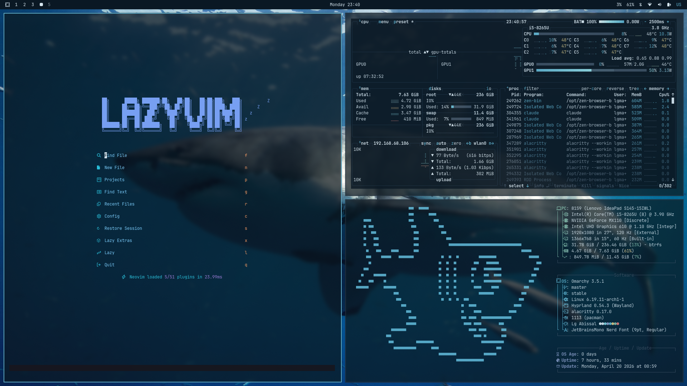

# lg-abissal

Tema escuro de inspiração marinha — azuis profundos sobre fundo quase preto, com foreground claro.

## Paleta

- **Accent:** `#5eb3d1` (azul-mar claro)
- **Background:** `#0a1824` (quase preto, tom azulado)
- **Foreground:** `#d6e6f0` (azul-gelo)

Paleta completa em `colors.toml`.

## Componentes

- `colors.toml` — paleta base usada por terminais
- `hyprland.conf` — bordas (ativa azul-claro, inativa azul-escuro)
- `btop.theme` — cores para o btop
- `neovim.lua` — usa `tokyonight-night`
- `vscode.json`, `icons.theme` — placeholders
- `backgrounds/` — wallpapers do tema:
  - `2-tubarao-maldivas.jpg`
  - `3-tubarao-branco.jpg`
