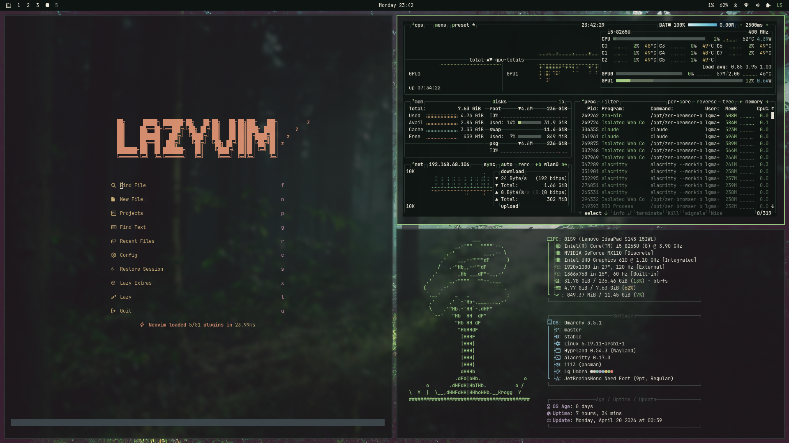

# lg-umbra

Tema escuro de inspiração florestal — verdes profundos sobre fundo quase preto, com toques de bege.

## Paleta

- **Accent:** `#9ccc85` (verde-musgo claro)
- **Background:** `#0e1412` (quase preto, tom esverdeado)
- **Foreground:** `#ece8d9` (bege claro)

Paleta completa em `colors.toml`.

## Componentes

- `colors.toml` — paleta base usada por terminais
- `hyprland.conf` — bordas (ativa verde, inativa cinza)
- `btop.theme` — cores para o btop
- `neovim.lua` — usa `everforest` (background hard)
- `vscode.json`, `icons.theme` — placeholders
- `backgrounds/` — wallpapers do tema:
  - `3-mata-entardecer.jpg`
